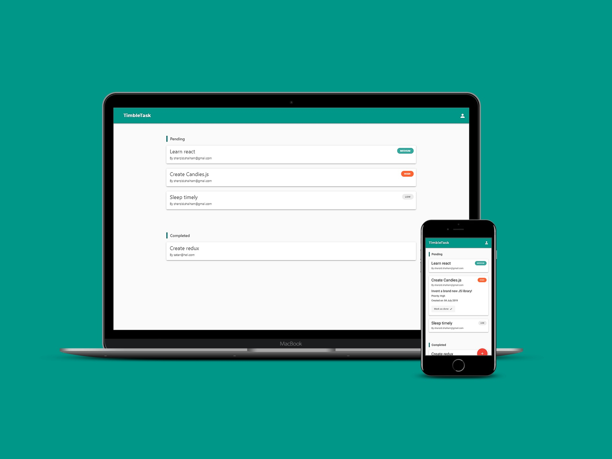

<b><h2>TimbleTask</h2></b> <i>(#learningReact)</i>
 <a href="https://timble-task.herokuapp.com/">https://timble-task.herokuapp.com/</a> 
A fully responsive Web Application for creating and sharing tasks. 
The program is built on ReactJS and uses Google Firebase for authentication and storing data. 
  

